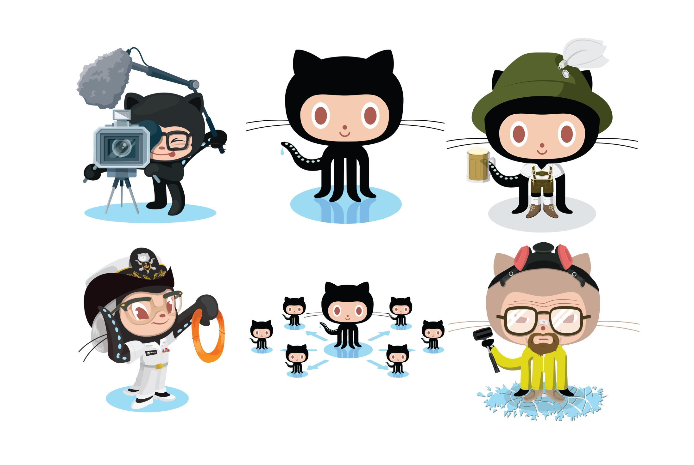
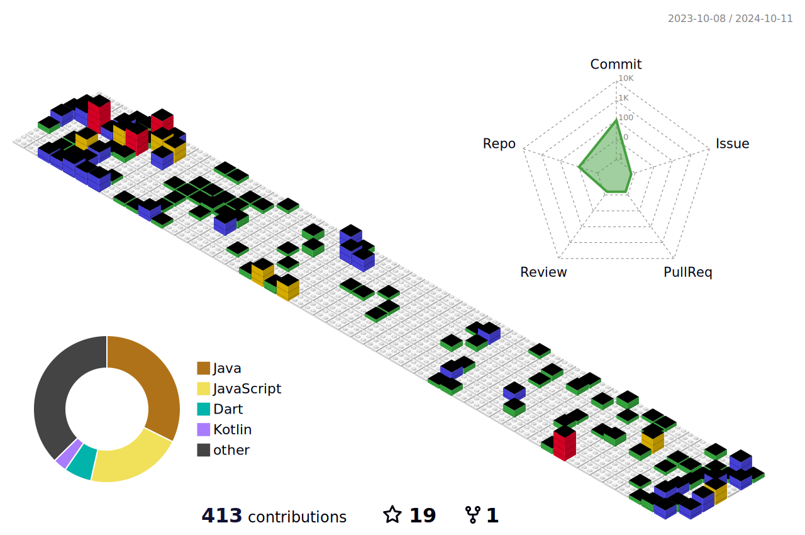

<!--  -->
<h1 align="center">
  Hi there, I'm <a href="https://www.linkedin.com/in/belinda-g-freitas">Belinda</a> 👋🏻
</h1>
<!-- socials -->

 
   
  
  
  
  
<!--    -->

 

I'm software engineer and I'm focused on mobile and desktop application development. Recently I've found myself liking APIs developement too.

## 💬 Like to talk about

- System design
- Flutter & Dart
- Mobile & desktop app development
- Node, Nest, Express & backend
- APIs & test
- Video games
- Food & books

#### Total contributions

 

<!-- #### Public contibutions in the last 365 days -->

<!--   -->

<!--  -->

 

## 🤡 Fun fact about me

I wanted to do software engineering after high school because I loved and still love playing video games, so I hoped that I could make my own games (with my own crazy features); but in the end I figured out that developing video games would tire my eyes twice (developping and then playing), and I probably won't be so excited to play my own games since I would have gotten accustomed to them during the dev proccess. So, I decided to be primarily a mobile and backend dev.

<!--  -->

<!-- stats -->
<!-- 
 -->
  <!-- most used languages -->
  <!--  -->
  <!-- github stats -->
<!--    -->
<!-- 
 -->

**Visitor count**

<!--  -->

## Coding stats from Wakatime since Nov 12 2023

<!-- ### Stats -->

<!--  -->

### Coded hours

### Languages

