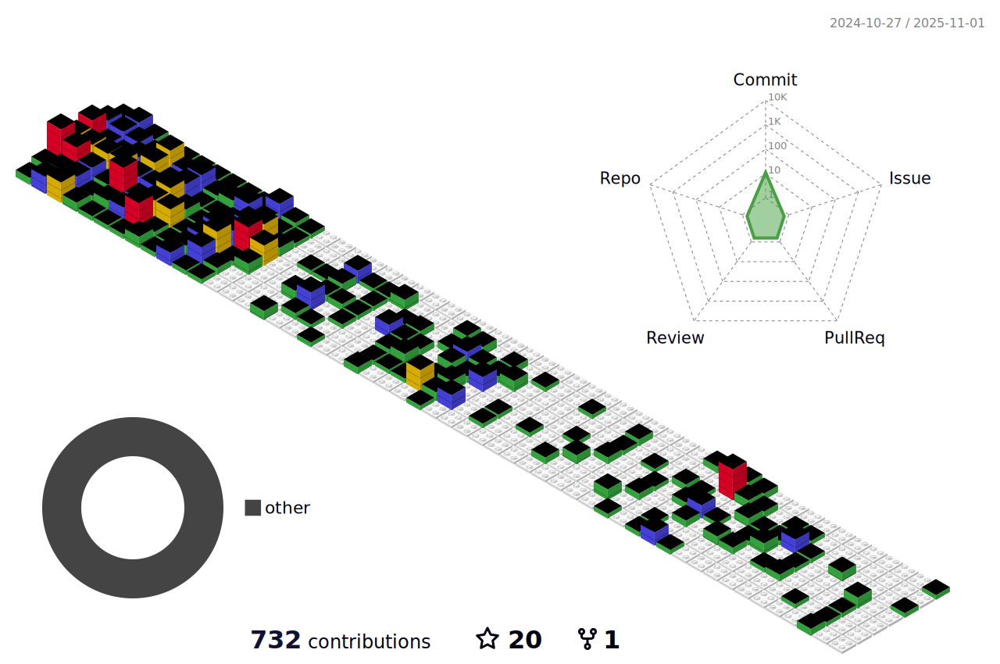

<!--  -->
<h1 align="center">
  Hi there, I'm <a href="https://github.com/belinda-g-freitas">Bélinda</a> 👋🏻
</h1>

I'm software engineer and I'm focused on mobile apps development now but I also work on desktop apps. Recently I found myself liking APIs developement, sometimes I even work on web apps.

## 💬 Like to talk about
- Mobile apps development
- Node.js
- Desktop apps
- Flutter & Dart
- Postman
- API integration
- Video games
- Food and travel

#### Total contributions 
 

#### Public contibutions in the last 365 days
 

 

## 🤡 Fun fact about me
I wanted to do software engineering after high school because I loved and still love playing video games, so I hoped that I could make my own games (with my own crazy features); but at the end I figured out that developing video games would tire my eyes twice (developping and then playing), and I probably won't be so excited to play my own games since I would have gotten accustomed to them during the dev proccess. So, at the end I decided to be mobile dev because it is my second favorite topic.

<!-- socials -->

 
   
   
  

 
<!-- stats -->
<!-- 
 -->
  <!-- most used languages -->
<!--    -->
  <!-- github stats -->
<!--    -->
<!-- 
 -->
 
<b>Visitor count</b>

